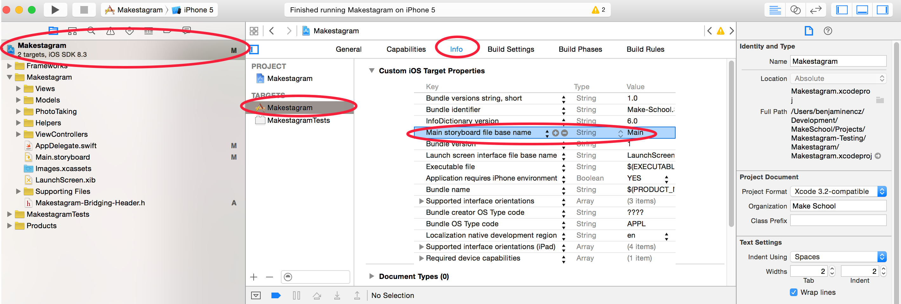
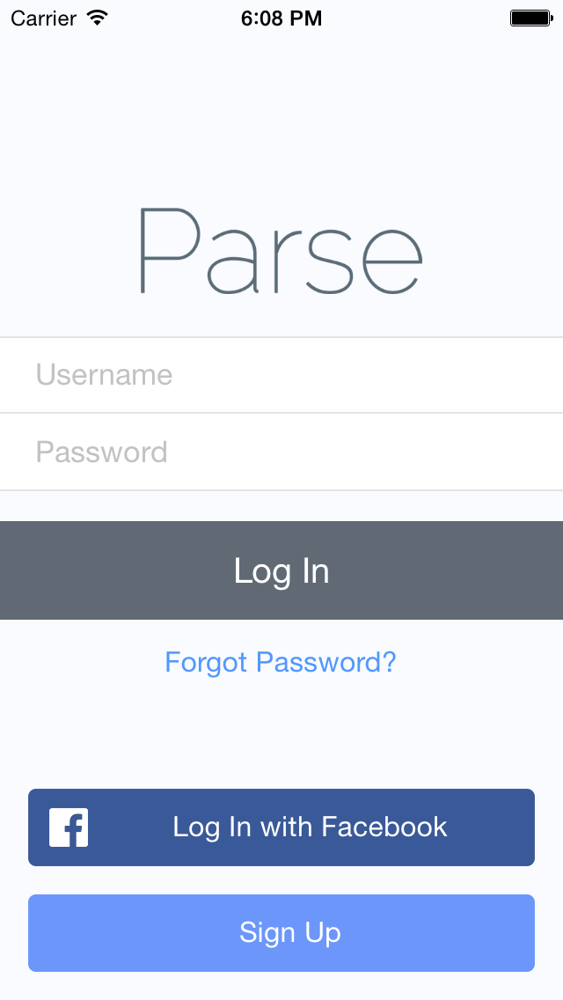
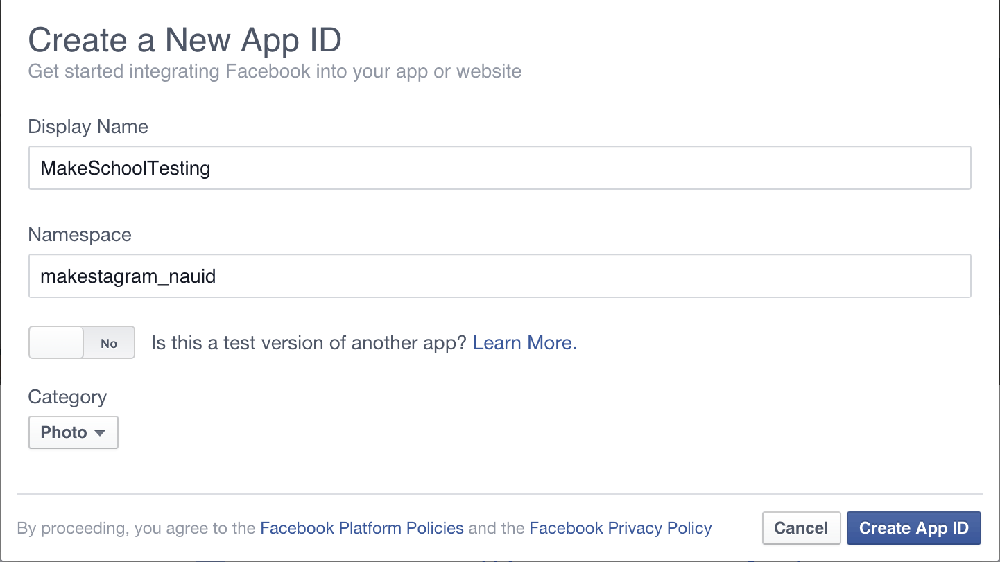
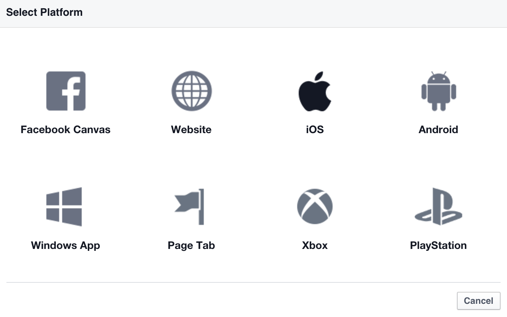
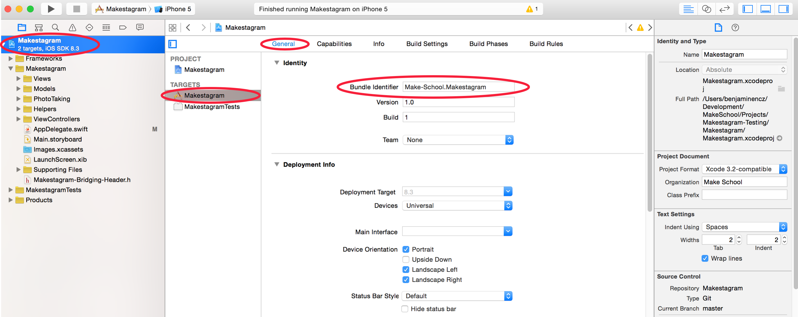
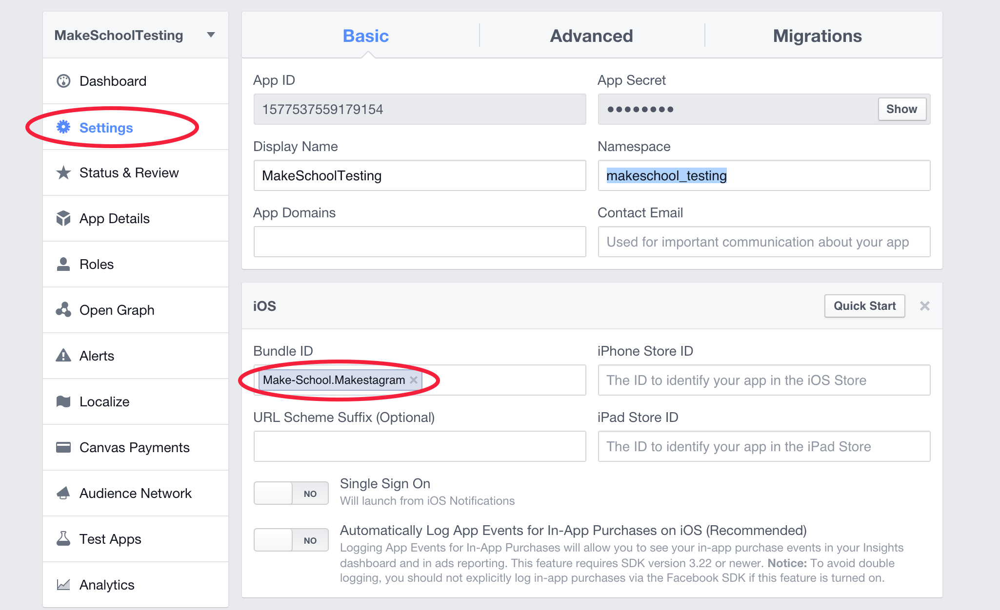
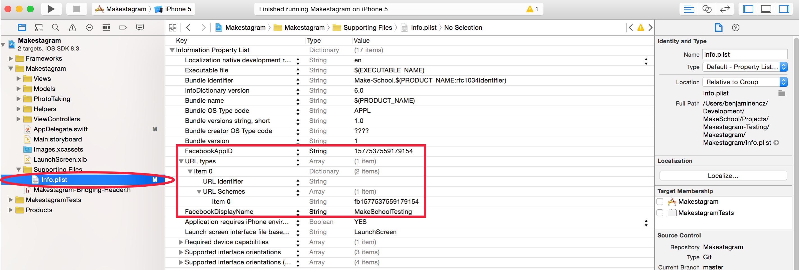

So far we have been using a placeholder login mechanism. In this step we will finally replace it with a real login and signup screen. Parse makes it fairly easy to create such a login screen by providing a default UI component that we can use in our app.

Signing up with an email address and a password is a standard feature that we'll provide; but it's a pretty old school way of joining a new app! We'll provide our users with a Facebook login option as well. That's a great way to take some friction out of the signup process.

Since this step will contain a few new concepts, we will discuss it in more detail than the last one. You'll learn how to change the initial view controller of your app and also how to configure **Makestagram** as a Facebook compatible application.

#Changing the Screen Flow

One of the first things we need to do, is changing the screen flow of our app. Currently the `TabBarViewController` is the main View Controller and gets presented as soon as the app starts.

Our new screen flow will depend on whether or not a user is currently signed in. If we have a signed in user we want to display the `TabBarViewController`; if no user is signed in we want to display the login / signup screen.

This will require some changes to our project settings. We can no longer simply display our main storyboard on launch, instead we need to write code that determines what the first view controller in our app should be.

Let's start by changing a setting in the _Info.plist_ that currently defines that the app should always start by displaying the _Main.storyboard_.

> [action]
Remove the _Main storyboard file base name_ entry from the apps _Info.plist_, by selecting it as shown in the image below, and hitting the delete key:

This entry defines which storyboard should be loaded and displayed upon app start. By removing it, we have the opportunity to define the initial view controller in code. You'll see how this works in just a second!

#Providing the Initial View Controller with an Identifier

When we want to write code to decide which view controller should be displayed first, we need a way to reference that specific view controller. For that purpose, Interface Builder provides each scene (a.k.a. view controller) within a storyboard a _Storyboard ID_. By default that ID is empty. If we want to reference a specific scene in code, we need to choose a _Storyboard ID_. For **Makestagram**, we want to display the `TabBarViewController` as soon as a user is logged in.

Let's provide a Storyboard ID for that controller.

> [action]
> Set the Storyboard ID for the _TabBarController_ to: _TabBarController_:
>

In many ways programming is a creative pursuit; however, when it comes to naming things, you're mostly better off making the obvious yet boring choice.

We're done with preparing our configuration, we can now get down to coding!

#Adding the Code

You've heard this question before: where should we place code that runs when our app starts?
**Correct: in the `AppDelegate`**. The `AppDelegate` is the class that is mainly responsible for communicating with the iOS operating system; it is also the class that receives a message when your app has launched. That's where we need to decide whether or not we want to confront our users with a login screen.

Our very first step will be deleting our existing login functionality. Soon we will have a real login screen, so we no longer need the placeholder code.

> [action]
> Delete the following lines from the `application(_:, didFinishLaunchingWithOptions:)` method in the `AppDelegate`:
>
    PFUser.logInWithUsername("test", password: "test")
>
    if let user = PFUser.currentUser() {
      println("Log in successful")
    } else {
      println("No logged in user :(")
    }

Now, let's start with the implementation of our new login mechanism by getting a dull task done - importing some modules.

> [action]
> Add the following import statements to _AppDelegate.swift_:
>
    import FBSDKCoreKit
    import ParseUI

Another thing that we should get out of the way is the boilerplate code that the Facebook SDK requires. There's nothing interesting about it; it just needs to be there to make things work.

> [action]
> Add the following two methods to the `AppDelegate` class and remove the existing implementation of `applicationDidBecomeActive`:
>
    //MARK: Facebook Integration
>
    func applicationDidBecomeActive(application: UIApplication) {
      FBSDKAppEvents.activateApp()
    }
>
    func application(application: UIApplication, openURL url: NSURL, sourceApplication: String?, annotation: AnyObject) -> Bool {
      return FBSDKApplicationDelegate.sharedInstance().application(application, openURL: url, sourceApplication: sourceApplication, annotation: annotation)
    }

Now we can finally get down to the actual login code. We're going to use a helper class makes using the Parse login functionality even easier. It is called `ParseLoginHelper`. We initialize that class with a closure that takes two arguments: a `user` and an `error`.

The closure that we provide when initializing the `ParseLoginHelper` will be called once the user has hit the login button and the server has responded with a success or failure message. We'll then either receive an `error` or a `user` and that will allow us to determine if the login was successful.

Let's create one of these `ParseLoginHelper`s.

> [action]
> Add the following property and initializer to the `AppDelegate`:
>
    var parseLoginHelper: ParseLoginHelper!
>
    override init() {
      super.init()
>
      parseLoginHelper = ParseLoginHelper {[unowned self] user, error in
        // Initialize the ParseLoginHelper with a callback
        if let error = error {
          // 1
          ErrorHandling.defaultErrorHandler(error)
        } else  if let _ = user {
          // if login was successful, display the TabBarController
          // 2
          let storyboard = UIStoryboard(name: "Main", bundle: nil)
          let tabBarController = storyboard.instantiateViewControllerWithIdentifier("TabBarController")
>         // 3
          self.window?.rootViewController!.presentViewController(tabBarController, animated:true, completion:nil)
        }
      }
    }

1. In case we receive an `error` in our closure, we call the `ErrorHandling.defaultErrorHandler` method. That error handler method was part of the template project. It displays a popup with the error message. We'll discuss error handling in more detail in one of the later steps.
2. If we didn't receive an `error`, but received a `user`, we know that our login was successful. In this case, we load the _Main_ storyboard and create the _TabBarController_. This is the line where we use the _Storyboard ID_ that we've set up earlier. Before we removed _Main.storyboard_ as the default entry point to our app, all of this was happening under the hood. Now we have to load storyboards and view controllers manually.
3. After we have loaded the view controller, we are also responsible for presenting it. We can choose the main view controller of our app, in code, by setting the `rootViewController` property of the `AppDelegate`'s `window`. When the code in this closure runs, our app will already have the login screen as its `rootViewController`. As soon as the successful login completes, we present the _TabBarController_ on top of the login screen.

Now we have the code in place that runs after a user attempted to log in - but where's the code that presents the login screen in the first place? We'll take care of that now.

We'll extend the `application(_:, didFinishLaunchingWithOptions:)` method to decide which View Controller should be the `rootViewController` of our app.

> [action]
>
> Add the following code to the end of the `application(_:, didFinishLaunchingWithOptions:)` method:
>
    // Initialize Facebook
    // 1
    PFFacebookUtils.initializeFacebookWithApplicationLaunchOptions(launchOptions)
>
    // check if we have logged in user
    // 2
    let user = PFUser.currentUser()
>
    let startViewController: UIViewController;
>
    if (user != nil) {
      // 3
      // if we have a user, set the TabBarController to be the initial view controller
      let storyboard = UIStoryboard(name: "Main", bundle: nil)
      startViewController = storyboard.instantiateViewControllerWithIdentifier("TabBarController") as! UITabBarController
    } else {
      // 4
      // Otherwise set the LoginViewController to be the first
      let loginViewController = PFLogInViewController()
      loginViewController.fields = [.UsernameAndPassword, .LogInButton, .SignUpButton, .PasswordForgotten, .Facebook]
      loginViewController.delegate = parseLoginHelper
      loginViewController.signUpController?.delegate = parseLoginHelper
>
      startViewController = loginViewController
    }
>
>     // 5
    self.window = UIWindow(frame: UIScreen.mainScreen().bounds)
    self.window?.rootViewController = startViewController;
    self.window?.makeKeyAndVisible()

1. We start of by initializing the `PFFacebookUtils` - this is only boilerplate code, once again.
2. We check whether or not a user is currently logged in.
3. If a user is logged in, we load the _TabBarControlller_, just as we did in the closure of the `ParseLoginHelper`, and let the user jump directly to the timeline.
4. If we don't have a user, we need to present the Login View Controller. We create one, using the `PFLoginViewController` provided by Parse. The component allows for some customization, you can read the details [here.](https://parse.com/tutorials/login-and-signup-views) We also set the `parseLoginHelper` as the `delegate` of the `PFLoginViewController`. The `ParseLoginHelper` will be notified about logins and signups by the `PFLoginViewController`. It will then forward the information to us by calling the closure that we defined when creating the `ParseLoginHelper`.
5. The last step is creating the `UIWindow` for our application. That's the container for all the views in our app. We then display the `startViewController` as the `rootViewController` of the app. Depending on whether we had a logged in user or not, this will be the `TabBarViewController` or the `PFLoginViewController`.

Awesome! Our login code is almost in place. There's one last change the Facebook SDK requires from us.

> [action]
> Replace the existing return statement in `application(_:, didFinishLaunchingWithOptions:)` with this one:
>
    return FBSDKApplicationDelegate.sharedInstance().application(application, didFinishLaunchingWithOptions: launchOptions)

Once again a boilerplate code requirement by the Facebook SDK that we don't need to discuss in detail.

Now it's time to try this new code out in action! First we need to delete the **Makestagram** app from the simulator to destroy our session. Otherwise Parse would remember that we're logged in and wouldn't show us the login screen.

> [action]
> Delete the _Makestagram_ app from the Simulator:
> <video width="100%" height="400pt" controls>
  <source src="https://s3.amazonaws.com/mgwu-misc/SA2015/DeleteApp_small.mov" type="video/mp4">

Now you can run the app again and it will be installed from scratch. When the app starts, you should see the login screen appear:

When you enter the credentials for the test user (username: _test_, password: _test_), you should be successfully logged in and see the timeline show up!

Awesome! Our login feature is almost complete! Except for one thing: when you hit the _Login with Facebook_ button your app will crash.

We'll tackle that issue next.

#Making the Facebook Login Work

To be able to login with Facebook, we need to register our app with their platform. Make sure you are signed up and logged in to Facebook so that you are able to access the Facebook Developer Portal. For future reference you can find the general setup guide [here](https://developers.facebook.com/docs/ios/getting-started). For now it will be easier to follow our instructions that are more specific to the **Makestagram** app.

Let's create a new Facebook app.

> [action]
> Open the Developer Portal through [this link](https://developers.facebook.com/?advanced_app_create=true). You should immediately see a popup that asks you for information about your app. Fill it out as shown below, but instead of *makestagram_nauid* put *makestagram_abcde* where *abcde* is your own random 5 characters at the end.

After you provided the information you will be redirected to the dashboard of your app.
Now we've set up a basics app, but Facebook also needs to know which platforms our app will support. For each platform (iOS, Android, Web, etc.) Facebook requires some specific information.

Let's tell Facebook that we're building an iOS app.

> [action]
> Switch to the _Settings_ page and select the _Add Platform_ button:

In the popup that shows up, select _iOS_:

Great! Now we need to configure on property of the iOS app that we created on Facebook: the _bundle identifier_. The bundle identifier is _the_ unique identifier for your app. Facebook will use the identifier to ensure that only our iOS app gets access to our Facebook app.

Let's find the bundle identifier for our app and provide it to Facebook.

> [action]
> Copy the _bundle identifier_ from your app, as shown in the image below:

> Then add it to your Facebook app as shown in this image:

Before we can test the Facebook login we'll need to make some changes to the _Info.plist_ file of our application. The _Info.plist_ is the main configuration file for every app.

> [action]
Open the app's _Info.plist_ as shown in the image below. Then configure it by performing the following steps from Facebook's setup guide (_Note that you can add new lines to a .plist by selecting an existing line and hitting the + button._):
1. Create a key called _FacebookAppID_ with a string value, and add the app ID there.
2. Create a key called _FacebookDisplayName_ with a string value, and add the Display Name you configured in the App Dashboard.
3. Create an array key called _URL types_ with a single array sub-item called _URL Schemes_. Give this a single item with your app ID prefixed with fb.

This is what the final plist should look like:

Now you should be good to test the Facebook login!

Delete the app from the Simulator, to destroy any existing sessions. Then run it again from Xcode. When you reach the login screen, select the _Login with Facebook_ button. The app should go into the background and you should be redirected to a screen that looks like this:

If you grant permission on this screen, you will be redirected to your app and you should be logged in successfully! If the login is not working as just described, go back and make sure you have followed the setup instructions exactly.

If it is working: Congratulations! You have learned how to implement a fully working login flow for your app!

#Conclusion

In this step, you learned how to change the configuration of an app so that the _Main.storyboard_ isn't automatically chosen as the entry point. You have learned how you can instead implement the selection of the main view controller in code, which allows us to elegantly hide the app content behind a login wall if a user isn't signed in.

You have also learned how to use the `ParseLoginHelper` and the `PFLoginViewController` to create signup and login flow for your app.

Finally, you have learned how to set up your app on Facebook, which allows users to sign up for your app using their Facebook account.

This step should serve as a good template for implementing the login and signup feature in your own app.

In the next step we will look into a small optimization for **Makestagram**. Even though it isn't obvious, it turns out that the app is using a large amount of memory...
