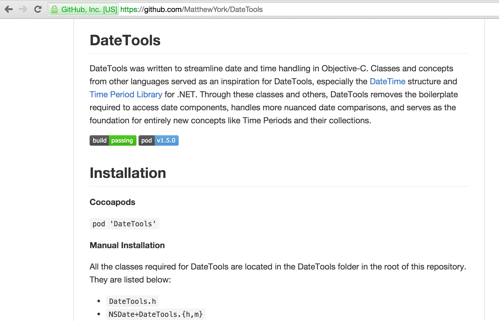
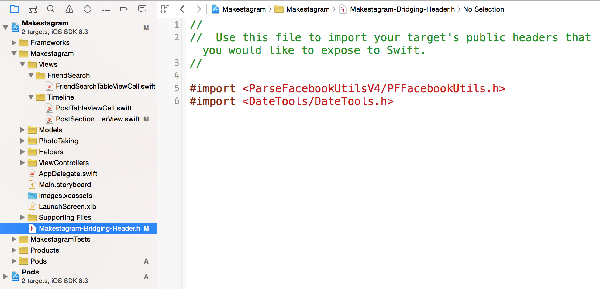
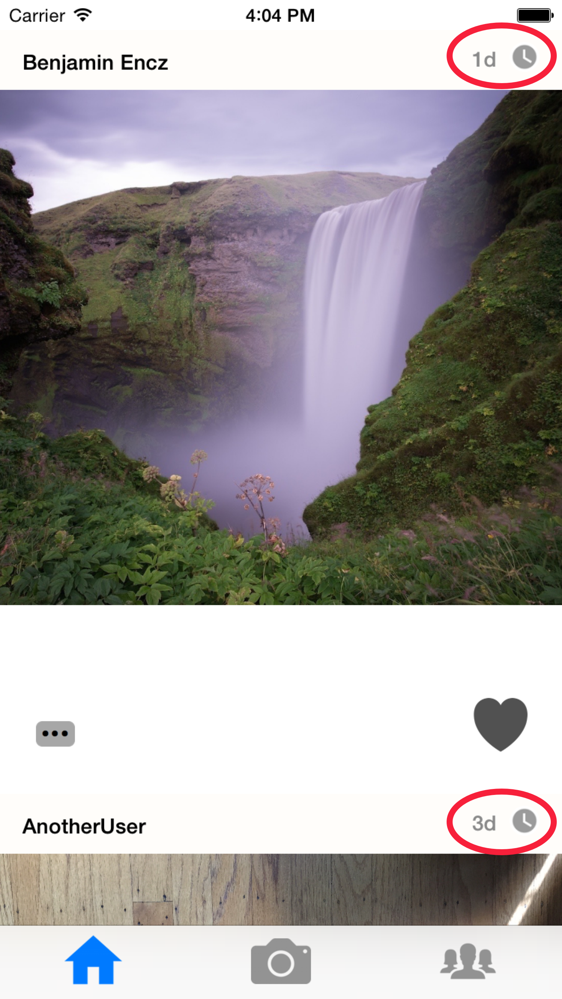

There are a lot of software developers worldwide and through the internet we are better connected than ever. Platforms such as GitHub and StackOverflow further improve our ability to share solutions to common problems we face in software development.

Once you start developing software, you will realize that many, if not most, of the problems you encounter have been solved by someone else before. Reusing these solutions in our own projects allows us to build software at unprecedented speeds.

This last step will show you how to easily incorporate third-party code into your iOS projects, before you head on to work on your own project.

We have also prepared a brief lecture that will bring you up to speed on how to use third-party code in your app:

<iframe width="560" height="315" src="https://www.youtube.com/embed/fvaY22g2R0w" frameborder="0" allowfullscreen></iframe>

You can download the slides [here](https://s3.amazonaws.com/mgwu-misc/SA2015/LectureSlides/Libraries.pdf).

#What Is a Dependency Manager?

One way of adding third-party code to your project would be to download all of the source code and copy it into your project.

This may sound straightforward, but in reality this approach will fail for many projects. Many third-party libraries come with their own dependencies and very special rules about how they need to be compiled; information that is not in the source files but in the project file of the library.

Even if that approach works, you will have a hard time updating the library. You will have to remove all code and add it again.

To avoid such kinds of problems, other software developers have built dependency managers. The most popular one for iOS is _CocoaPods_.

#How Does CocoaPods Work?

_CocoaPods_ provides a huge repository of available iOS libraries. When you want to use _CocoaPods_ you add a special file to your project in which you can list your dependencies. That file is called a _Podfile_.

If you want to use a library, you need to enter the name (and optionally the version) of the library into your _Podfile_. Then you can use one of _CocoaPods_'s commands to install the library that you listed in the _Podfile_.

#Installing CocoaPods

As a first step, we need to install the _CocoaPods_ software.

> [action]
> Open a terminal and enter the following line:
>
    sudo gem install cocoapods

After a while the installation should complete successfuly!

#Setting up A Podfile

Now we can create a _Podfile_ that will allow us to declare dependencies for our project. The _CocoaPods_ tool provides us with a convenient method to do this:

> [action]
> Open the root directory of your project in a terminal and type:
>
    pod init

Now a _Podfile_ with some skeleton content will be created. Open the _Podfile_ in your favorite text editor. It should look like this:

    # Uncomment this line to define a global platform for your project
    # platform :ios, '6.0'

    target 'Makestagram' do

    end

    target 'MakestagramTests' do

    end

#Installing a Library

Now we are ready to add a dependency to this file. For the feature we want to implement - displaying the amount of time that has passed since a post was created - we want to use the _DateTools_ library.
It will help us to convert time spans into human readable strings.

Now how do you find such a library on your own? **Google!** For example _"Date time since iOS library"_. In many cases your search terms will lead you to a GitHub page as shown below:

That GitHub page will typically contain the name _CocoaPod_ of the library, which allows you to add it your _Podfile_.

> [action]
> Add the _DateTools_ dependency to your _Podfile_ so that it looks like this:
>
    # Uncomment this line to define a global platform for your project
    # platform :ios, '6.0'
>
    target 'Makestagram' do
      pod 'DateTools'
    end
>
    target 'MakestagramTests' do
>
    end
>
> Then, return to the command line and run:
>
    pod install

Now your dependencies will be download and installed.

**The next step is very important.** After you have installed your first library, _CocoaPods_ will generate an _Xcode workspace_ for you. When using _CocoaPods_, you need work with that _workspace_ and no longer with the Xcode _project_ that you have been working with.

> [action]
> **Close** your Xcode project. Then open the new **workspace** that _CocoaPods_ has generated:
> 

#Importing the Library

If you have installed a Swift library, you can import it with the regular, well known `import` statement in any of your Swift files, e.g.:

    import MyLibrary

However, most of the Libraries that you will use will be written in Objetive-C, Apple's old default programming language for iOS. These libraries need to be imported a little bit differently.

To import Objective-C libraries, you need to add them to a _Bridging Header_. Our template project already comes with such a bridging header, so let's add the _DateTools_ library to it.

> [action]
> Add the _DateTools_ library to _Makestagram's_ bridging header as shown below:

#Using the Library

Now we can finally use the Library to display how long ago a post has been created!
Let's extend the `PostSectionHeaderView` to use the new library.

> [action]
> Extend the `didSet` observer of the `post` property in the `PostSectionHeaderView` as following:
>
    var post: Post? {
      didSet {
        if let post = post {
          usernameLabel.text = post.user?.username
          // 1
          postTimeLabel.text = post.createdAt?.shortTimeAgoSinceDate(NSDate()) ?? ""
        }
      }
    }

1. We are reading the `createdAt` date from the `post`. This is a property that Parse sets by default on all `PFObjects`. Then we use an extension provided by the _DateTools_ library: `shortTimeAgoSinceDate(_:)`. This method takes a comparison date. By calling `NSDate()` we create a date object with the current time. If the post has been created 4 hours ago, this line of code will generate the string _"4h"_. Since `createdAt?` is an optional, we use the `??` operator to fall back to an empty string, in case the 'createdAt' date should be nil.

Awesome! Now it's once again time to test this new feature. When running the app you should now see that the header cells display how long ago a post has been created:

#Conclusion

In this step you have learned how to leverage the power of open source software in your project. There couldn't be a better way to end this _Makestagram_ tutorial!

Now it's time to take everything you have learned and build your very own app! And always remember: some developer might already have solved your problem for you. The answers are at your fingertips!
